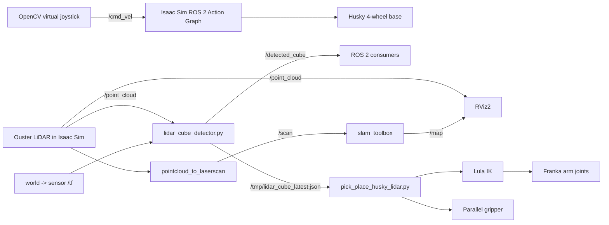

# Husky-Franka Mobile Manipulator in Isaac Sim

Isaac Sim에서 Clearpath Husky, Franka Panda, Ouster LiDAR를 결합해 모바일 매니퓰레이터를 구성하고, ROS 2 기반 주행·시각화·SLAM 및 물체 인지 기반 Pick & Place로 확장하는 프로젝트입니다.

이 문서는 저장소의 전체 Python 스크립트와 2026년 3월부터 5월까지의 랩미팅 자료를 바탕으로 작성한 인수인계 문서입니다.

## 1. 프로젝트 목표

최종 목표는 다음의 전체 파이프라인을 구현하는 것입니다.

1. Husky가 LiDAR 기반 SLAM으로 자신의 위치와 주변 지도를 추정합니다.
2. Husky가 작업 대상 근처로 이동합니다.
3. LiDAR 또는 RGB 카메라로 원하는 물체를 식별하고 3차원 위치를 추정합니다.
4. Husky 위의 Franka Panda가 물체를 집어 지정 위치로 옮깁니다.
5. 시뮬레이션에서 검증한 구성을 실제 Husky에 적용합니다.

현재는 Husky-Franka 결합, ROS 2 주행, LiDAR PointCloud2 시각화, simulation ground-truth 기반 Pick & Place까지 구현했습니다. LiDAR 물체 인지와 SLAM은 초기 구현 및 실험 단계입니다.

## 2. 현재 진행 상태

| 항목 | 상태 | 비고 |
|---|---|---|
| Isaac Sim 및 ROS 2 환경 구성 | 완료 | Ubuntu 24.04 ARM64, Isaac Sim 5.1, ROS 2 Jazzy |
| Husky URDF/USD 구성 | 완료 | NVIDIA 기본 Asset에 없어 ROS 2 Husky 모델을 가져와 사용 |
| Husky 외부 제어 | 완료 | OpenCV 가상 조이스틱이 `/cmd_vel` 발행 |
| Ouster LiDAR 장착 | 완료 | Husky top plate 하위에 장착 |
| PointCloud2-RViz2 연동 | 완료 | `/point_cloud`, `/tf`, Fixed Frame `world` |
| Franka Panda 장착 | 완료 | `/husky` 아래 단일 articulation으로 결합 |
| 고정 Husky Pick & Place | 완료 | USD cube ground-truth와 Lula IK direct 방식 |
| 이동 Husky Pick & Place | 구현 | 도달 가능 거리 진입 시 자동 시작, 재검증 필요 |
| LiDAR cube 후보 검출 | 초기 구현 | self-return 및 stand/cube 혼합 문제 존재 |
| LiDAR 기반 Pick & Place | 실험 단계 | JSON 추정값 연결 완료, 안정적인 grasp는 미완성 |
| LiDAR SLAM | 초기 구성 | PointCloud2→LaserScan→slam_toolbox, 최종 검증 필요 |
| 실제 Husky 적용 | 미진행 | 정식 odometry/TF와 Sim2Real 검증 필요 |

가장 안정적인 기준 동작은 `pick_place_husky.py`의 **정지 상태 ground-truth Pick & Place**입니다. 이후 기능을 수정할 때 먼저 이 기준 동작을 재현하는 것을 권장합니다.

## 3. 개발 경과

랩미팅 자료에서 확인되는 프로젝트의 흐름은 다음과 같습니다.

| 날짜 | 주요 진행 내용 |
|---|---|
| 2026-03-06 | NUC 듀얼 부팅, Isaac Sim 설치, Omniverse Core API와 Python 기반 로봇 구동 학습 시작 |
| 2026-04-03 | ROS 2 Husky URDF를 Isaac Sim에 import, 물리·mesh·Action Graph 구성, Ouster OS1 계열 LiDAR import |
| 2026-05-01 | OpenCV 가상 조이스틱 제작, NVIDIA SimpleRoom 테스트 환경 구성, `/point_cloud`를 RViz2에서 시각화 |
| 2026-05-29 | Franka 예제 분석, Husky 위에 Panda 장착, 모바일 매니퓰레이터 Pick & Place, RMPflow와 Lula IK 비교, LiDAR/RGB perception 방향 설정 |

GIST 캠퍼스 Omniverse 제작과 도면 기반 3D 모델링도 같은 인턴 과제로 진행됐지만, 해당 작업은 이 저장소의 모바일 매니퓰레이터 코드 범위에는 포함되지 않습니다.

## 4. 시스템 구성



현재 LiDAR Pick & Place는 Isaac Sim 내부 스크립트와 외부 ROS 2 프로세스를 직접 연결하지 않습니다. `lidar_cube_detector.py`가 `/tmp/lidar_cube_latest.json`을 원자적으로 갱신하고, Isaac Sim 스크립트가 이 파일을 읽는 임시 브리지 구조입니다.

## 5. 기준 개발 환경

기존 작업 환경은 다음과 같습니다.

- 머신: NVIDIA GB10, ARM64/aarch64
- OS: Ubuntu 24.04
- Isaac Sim: 5.1
- ROS 2: Jazzy
- Isaac Sim 설치 경로: `/home/user/Desktop/isaac-sim-5.1`
- 기존 프로젝트 경로: `/home/user/Desktop/260527 KMS`
- Isaac Sim Python: `/home/user/Desktop/isaac-sim-5.1/python.sh`
- ROS 2 Python: `/usr/bin/python3` 3.12

ROS 2 Jazzy apt 패키지는 시스템 Python 3.12를 기준으로 설치됩니다. 기본 `python3`가 Conda Python 3.13을 가리키면 `rclpy` import가 실패할 수 있으므로, 외부 ROS 2 노드는 제공된 shell wrapper 또는 `/usr/bin/python3`로 실행해야 합니다.

필요한 주요 ROS 2 패키지는 다음과 같습니다.

```bash
sudo apt-get update
sudo apt-get install -y \
  python3-opencv \
  python3-numpy \
  ros-jazzy-slam-toolbox \
  ros-jazzy-pointcloud-to-laserscan
```

저장소에는 100MB가 넘는 USDZ가 Git LFS로 관리되므로 clone 전에 Git LFS를 준비합니다.

```bash
git lfs install
git clone https://github.com/kms8720/husky-franka-manipulator-in-isaacsim.git
cd husky-franka-manipulator-in-isaacsim
git lfs pull
```

## 6. 중요 Asset과 Scene 구조

| 파일 | 설명 |
|---|---|
| `husky_test.usdz` | Husky와 LiDAR가 포함된 원본/백업 scene |
| `husky_franka.usd` | Franka 결합과 floor 보정을 마친 현재 주 작업 scene |

주요 USD prim 경로:

| 역할 | Prim 경로 |
|---|---|
| 전체 articulation root | `/husky` |
| Husky base | `/husky/base_link` |
| Husky top plate | `/husky/base_link/top_plate_link` |
| Franka root | `/husky/panda` |
| Franka base frame | `/husky/panda/panda_link0` |
| IK end-effector frame | `/husky/panda/panda_hand` |
| 코드상 gripper end-effector prim | `/husky/panda/panda_rightfinger` |
| Franka-Husky fixed joint | `/husky/panda/panda_mount_joint` |
| 실제 보이는 floor surface | `/SimpleRoom/Towel_Room01_floor_bottom_218/Towel_Room01_floor_bottom` |

전체 로봇은 `/husky` 하나의 articulation으로 동작합니다. 총 13 DOF는 Husky wheel 4개, Franka arm 7개, gripper finger 2개로 구성됩니다. DOF 순서는 고정이라고 가정하지 않고 항상 `robot.get_dof_index(name)`으로 arm joint index를 찾습니다.

Franka 원본 Asset 경로는 `mount_franka.py`에 하드코딩되어 있습니다.

```python
FRANKA_USD = "/home/user/Downloads/.../FrankaPanda/franka.usd"
```

다른 머신에서 scene을 다시 구성하려면 먼저 이 경로를 실제 Franka Asset 위치로 수정해야 합니다. 이미 완성된 `husky_franka.usd`를 사용하는 경우에는 일반적으로 `mount_franka.py`를 다시 실행할 필요가 없습니다.

## 7. 빠른 시작

아래 예시는 Ubuntu 작업 경로가 `/home/user/Desktop/260527 KMS`인 기존 환경을 기준으로 합니다. 다른 위치에 clone했다면 `PROJECT_DIR`만 변경합니다.

### 7.1 가장 먼저 확인할 기준 동작

1. Isaac Sim 5.1에서 `husky_franka.usd`를 엽니다.
2. Timeline을 **STOP** 상태로 둡니다.
3. Script Editor에서 실행합니다.

```python
PROJECT_DIR = "/home/user/Desktop/260527 KMS"
exec(open(f"{PROJECT_DIR}/pick_place_husky.py").read())
```

4. Timeline에서 **PLAY**를 누릅니다.
5. 콘솔의 `[B] PICK & PLACE DONE.`과 phase 4 이후 상승하는 `cube_z`를 확인합니다.

이 스크립트는 Husky 앞 stand 위에 cube를 생성하고, cube의 USD world pose를 읽어 집은 뒤 Husky top plate 위로 옮깁니다.

### 7.2 Husky 가상 조이스틱

Isaac Sim scene의 ROS 2 Action Graph가 `/cmd_vel`을 구독하는 상태에서 실행합니다.

```bash
cd "/home/user/Desktop/260527 KMS"
DISPLAY=:0.0 ./run_controller.sh
```

마우스로 흰색 스틱을 드래그하면 다음 명령이 발행됩니다.

- 전후: `Twist.linear.x`
- 좌우 회전: `Twist.angular.z`
- 토픽: `/cmd_vel`
- 최대 선속도: 1.0 m/s
- 최대 각속도: 1.0 rad/s

확인:

```bash
source /opt/ros/jazzy/setup.zsh
ros2 node list
ros2 topic info /cmd_vel
ros2 topic echo /cmd_vel
```

참고로 `husky_controller.py`의 주석은 50Hz라고 되어 있지만 현재 timer 값은 `0.001`초이므로 실제 요청 주기는 1000Hz입니다. 시스템 부하가 크면 `create_timer(0.02, ...)`로 조정하는 것이 좋습니다.

### 7.3 이동 Husky에서 ground-truth Pick & Place

Isaac Sim이 STOP일 때:

```python
PROJECT_DIR = "/home/user/Desktop/260527 KMS"
exec(open(f"{PROJECT_DIR}/pick_place_husky_mobile.py").read())
```

PLAY 후 조이스틱으로 천천히 전진합니다. `panda_link0`와 cube의 XY 거리가 0.45~0.72m에 들어오면 자동으로 Pick & Place가 시작됩니다.

```text
[M] WAIT reach_xy=...
[M] START pick/place. reach_xy=...
[M] MOBILE PICK & PLACE DONE.
```

grasp가 시작되면 Husky를 정지시키는 편이 안정적입니다.

### 7.4 LiDAR PointCloud2 시각화

Isaac Sim이 `/point_cloud`와 `world -> sensor` TF를 발행하는지 먼저 확인합니다.

```bash
source /opt/ros/jazzy/setup.zsh
ros2 topic list -t
ros2 topic hz /point_cloud
ros2 run tf2_ros tf2_echo world sensor
```

RViz2 실행:

```bash
cd "/home/user/Desktop/260527 KMS"
./run_rviz.sh -d husky_lidar.rviz
```

기본 설정은 Fixed Frame `world`, PointCloud2 토픽 `/point_cloud`, Best Effort QoS입니다.

### 7.5 LiDAR cube detector

```bash
cd "/home/user/Desktop/260527 KMS"
./run_lidar_detector.sh
```

출력:

- ROS 2 토픽: `/detected_cube` (`geometry_msgs/msg/PointStamped`)
- 파일: `/tmp/lidar_cube_latest.json`
- 좌표계: `world`

정상 후보 로그 예:

```text
[lidar] raw=4879 cand=171 clusters=2
centroid=(+0.007,+3.445,+0.375)
target=(+0.007,+3.445,+0.431)
sensor=(+1.027,-0.034,-0.263)
size=(0.242,0.133,0.090) n=143
```

현재 검출기는 정답 분류 모델이 아니라 ROI와 2D grid connected-component clustering을 이용한 휴리스틱입니다. 출력이 있다고 해서 cube를 올바르게 찾았다는 의미는 아닙니다.

### 7.6 LiDAR 추정값 기반 Pick & Place

터미널에서 detector와 controller를 실행한 다음, Isaac Sim STOP 상태에서:

```python
PROJECT_DIR = "/home/user/Desktop/260527 KMS"
exec(open(f"{PROJECT_DIR}/pick_place_husky_lidar.py").read())
```

PLAY 후 Husky를 천천히 접근시킵니다. 스크립트는 0.75초 이내에 생성된 `world` frame JSON만 사용합니다. 로그의 `gt_err`는 LiDAR 추정 좌표와 simulation ground-truth의 오차이며 디버깅에만 사용됩니다. 실제 IK target은 JSON의 LiDAR 추정 좌표입니다.

오차가 계속 5~10cm 이상이거나 target이 크게 흔들리면 grasp를 진행하기 전에 detector 파라미터를 조정해야 합니다.

### 7.7 SLAM 초기 실험

Isaac Sim을 PLAY하고 LiDAR 토픽이 발행되는 상태에서 각 명령을 별도 터미널에서 실행합니다.

터미널 1:

```bash
cd "/home/user/Desktop/260527 KMS"
./run_pointcloud_to_scan.sh
```

터미널 2:

```bash
cd "/home/user/Desktop/260527 KMS"
./run_slam_toolbox_husky.sh
```

터미널 3:

```bash
cd "/home/user/Desktop/260527 KMS"
DISPLAY=:0.0 ./run_controller.sh
```

검증:

```bash
source /opt/ros/jazzy/setup.zsh
ros2 topic echo /scan --once
ros2 topic echo /map --once
```

현재 설정은 wheel odometry가 없기 때문에 `world`를 odom frame처럼, `sensor`를 base frame처럼 사용하는 임시 구성입니다.

```text
map -> world -> sensor
```

정식 구조는 다음과 같이 바꾸는 것이 목표입니다.

```text
map -> odom -> base_link -> sensor
```

## 8. Python 스크립트별 역할

### Scene 구성 및 진단

| 파일 | 실행 위치/상태 | 역할 |
|---|---|---|
| `mount_franka.py` | Isaac Script Editor, STOP | Franka Asset을 `/husky/panda`에 reference하고 독립 rootJoint/ArticulationRoot를 제거한 뒤 Husky base와 FixedJoint로 결합 |
| `diagnose_poses.py` | Isaac Script Editor, STOP | Husky/Franka 주요 prim world pose, articulation root, rootJoint, mount joint 관계 확인 |
| `diagnose_floor.py` | Isaac Script Editor, STOP | top-level prim, floor 후보, mesh 최저점, wheel 높이를 읽는 비파괴 진단 |
| `lift_floor_to_zero.py` | Isaac Script Editor, STOP | `/husky`와 `/SimpleRoom`을 함께 이동해 기준 floor를 z=0으로 보정 |
| `arm_control_test.py` | Isaac Script Editor, PLAY | 결합 articulation에서 Franka arm 7개 joint에 직접 target을 보내는 sanity test |

`mount_franka.py`와 `lift_floor_to_zero.py`는 scene을 수정합니다. 실행 후 결과가 올바른지 확인하고 별도 이름으로 저장하거나 백업한 뒤 저장하십시오.

### Manipulator 제어

| 파일 | 역할 | 좌표 출처 | 상태 |
|---|---|---|---|
| `reach_test_husky.py` | 결합 articulation에서 RMPflow reach 가능성 확인 | USD cube ground-truth | 진단/과거 실험 |
| `pick_place_husky_rmp.py` | RMPflow의 느린 응답을 보여주는 비교용 실패 demo | USD cube ground-truth | 의도적으로 성공용이 아님 |
| `pick_place_husky.py` | 정지 Husky에서 stand 위 cube를 top plate로 이동 | USD cube ground-truth | 현재 기준 성공 구현 |
| `pick_place_husky_mobile.py` | Husky가 reach band에 들어오면 자동 Pick & Place | USD cube ground-truth | 모바일 연결 구현 |
| `pick_place_husky_lidar.py` | LiDAR JSON target으로 자동 Pick & Place | LiDAR 추정값 | 실험 단계 |

### ROS 2 외부 노드

| 파일 | 역할 |
|---|---|
| `husky_controller.py` | OpenCV 가상 조이스틱과 `/cmd_vel` publisher |
| `lidar_cube_detector.py` | `/point_cloud`와 `/tf`를 받아 cube/stand 후보를 추정하고 `/detected_cube` 및 JSON으로 출력 |

## 9. 보조 파일

| 파일 | 역할 |
|---|---|
| `run_controller.sh` | ROS 2 환경을 source하고 시스템 Python으로 조이스틱 실행 |
| `run_lidar_detector.sh` | ROS 2 환경을 source하고 시스템 Python으로 detector 실행 |
| `run_rviz.sh` | ROS 2 Jazzy 환경에서 RViz2 실행 |
| `run_pointcloud_to_scan.sh` | `/point_cloud`를 `/scan`으로 변환 |
| `run_slam_toolbox_husky.sh` | Husky용 slam_toolbox parameter를 사용해 mapping 실행 |
| `slam_toolbox_husky_params.yaml` | 임시 `world`/`sensor` frame 기반 SLAM 설정 |
| `husky_lidar.rviz` | `/point_cloud`와 TF 확인용 RViz2 설정 |
| `HANDOFF.md` | 실험 당시 로그, 원인 분석, 해결 과정이 포함된 상세 기록 |

## 10. Manipulator 구현 핵심

### 10.1 단일 articulation

기본 Franka 예제는 Franka가 독립 articulation이고 base가 고정되어 있다고 가정합니다. 이 프로젝트에서는 `/husky`가 단일 articulation root이며 Franka는 그 하위의 일부입니다.

따라서 `SingleManipulator("/husky/panda")`가 아니라 다음 구조를 사용합니다.

```python
robot = SingleArticulation(prim_path="/husky")
arm_idx = np.array([
    robot.get_dof_index(f"panda_joint{i}")
    for i in range(1, 8)
])
```

IK가 반환한 7개 joint target은 `arm_idx`에만 적용하고, 두 finger joint는 `ParallelGripper`가 별도로 제어합니다. 이 구분이 없으면 `(1,7)`과 `(1,9)` shape mismatch가 발생합니다.

### 10.2 PickPlaceController와 Lula IK

Isaac Sim의 `PickPlaceController`는 다음 10단계 상태머신을 제공합니다.

1. cube 위로 이동
2. cube로 하강
3. 안정화 대기
4. gripper 닫기
5. 들어 올리기
6. place XY로 이동
7. place Z로 하강
8. gripper 열기
9. 다시 상승
10. 복귀

기본 예제의 RMPflow는 매 step 부드러운 action을 생성하지만, 결합 로봇에서는 phase 시간 안에 cube에 도달하지 못했습니다. 현재 성공 구현은 상태머신은 유지하고 motion generation만 `LulaKinematicsSolver.compute_inverse_kinematics()` 기반 direct IK로 교체했습니다.

- RMPflow 실험: `panda_link0` local target 사용
- Lula IK 성공 구현: world frame target 사용
- IK frame: `panda_hand`
- 실제 grasp point 보정: `end_effector_offset=[0, 0, 0.103]`
- gripper open: `[0.04, 0.04]`
- gripper closed: `[0.022, 0.022]`
- IK position tolerance: 0.005m
- IK orientation tolerance: 0.20rad

Lula IK direct 방식에는 collision avoidance가 없습니다. 새로운 장애물이나 scene에서 사용할 때는 충돌 검사를 별도로 추가해야 합니다.

### 10.3 Scene 높이와 작업물 배치

`/SimpleRoom/Floor/SM_Template_Map_Floor`는 z=0이지만, 실제로 cube와 stand가 닿는 보이는 floor surface는 약 z=+0.0458m였습니다. 따라서 Pick & Place 스크립트는 `FLOOR_PRIM`의 world z를 읽어 stand와 cube 높이를 계산합니다.

주요 상수:

| 상수 | 값 | 의미 |
|---|---:|---|
| `CUBE_SIZE` | 0.05m | cube 한 변 |
| `STAND_HEIGHT` | 0.35m | Franka reach를 위한 받침대 높이 |
| `STAND_XY` | 0.25m | 받침대 폭과 깊이 |
| `STAND_FORWARD` | 0.70m | 고정 demo의 초기 전방 거리 |
| `STAND_FORWARD_INITIAL` | 1.15m | 모바일 demo의 초기 전방 거리 |
| `REACH_MIN_XY` | 0.45m | 모바일 grasp 시작 최소 거리 |
| `REACH_MAX_XY` | 0.72m | 모바일 grasp 시작 최대 거리 |
| `TOOL_CENTER_OFFSET_Z` | 0.103m | `panda_hand`에서 실제 grasp center까지 보정 |

top plate의 전방 축에 관한 과거 주석이 파일마다 `+x` 또는 `+y`로 다릅니다. 현재 성공한 place 코드는 `top_plate_link` local `(0.30, 0.0, 0.10)`을 사용합니다. scene이나 mount 방향을 바꾸면 주석만 믿지 말고 USD world transform과 실제 이동 방향을 다시 확인하십시오.

## 11. LiDAR detector 세부사항

`lidar_cube_detector.py`는 다음 가정에 의존합니다.

- `/point_cloud`의 frame은 `sensor`
- `/tf`에 직접적인 `world -> sensor` transform이 존재
- PointCloud2의 x, y, z가 float32이며 byte offset 0, 4, 8에 위치
- 대상은 sensor 전방 0.35~2.0m, 좌우 ±0.40m
- 대상 높이는 world z 0.32~0.58m
- sensor range는 최대 3.0m

처리 순서:

1. PointCloud2를 NumPy XYZ로 변환
2. NaN/Inf와 최대 거리 밖 점 제거
3. `world -> sensor` TF로 world 좌표 변환
4. world 높이, sensor 전방/좌우 ROI 적용
5. 로봇 자체 반사로 추정되는 근거리 측면 점 제거
6. world XY를 0.06m grid로 나누고 8-connected component clustering
7. 점 수, cluster 크기, 높이, 전방 중앙성으로 후보 점수 계산
8. 선택 cluster의 최대 z를 grasp target z로 사용

현재 알려진 문제:

- stand와 cube가 하나의 cluster로 합쳐질 수 있습니다.
- x/y는 합쳐진 cluster centroid라 실제 cube 중심과 어긋날 수 있습니다.
- Husky body, LiDAR mount, floor 또는 wall fragment가 후보가 될 수 있습니다.
- 단일 프레임 결과를 사용하므로 추정값이 흔들립니다.
- 의미론적 object identity가 없어서 “파란 cube”와 다른 물체를 구분하지 못합니다.

우선 조정할 상수:

```python
MIN_WORLD_Z = 0.32
MAX_WORLD_Z = 0.58
MIN_FORWARD = 0.35
MAX_FORWARD = 2.0
MAX_LATERAL_ABS = 0.40
SELF_FILTER_FORWARD = 0.55
SELF_FILTER_LATERAL_ABS = 0.32
GRID_RESOLUTION = 0.06
MIN_CLUSTER_POINTS = 12
MIN_CLUSTER_Z_SIZE = 0.025
MIN_CLUSTER_XY_SIZE = 0.08
```

## 12. 재실행 시 주의사항

Isaac Sim Script Editor 스크립트는 physics-step callback을 등록합니다. 한 번 실행한 뒤 단순히 `STOP -> PLAY`만 하면 Python state는 남아 있지만 PhysX articulation view는 무효가 될 수 있습니다.

가장 안전한 재실행 순서:

1. STOP
2. Script Editor에서 해당 파일을 다시 `exec(...)`
3. PLAY

`DynamicCuboid`는 PLAY 중 PhysX가 pose를 관리합니다. cube와 stand를 직접 옮기려면 STOP 상태에서 둘을 함께 이동한 뒤, 스크립트를 다시 실행하지 말고 바로 PLAY해야 합니다. 다시 `exec(...)`하면 코드의 초기 위치로 respawn됩니다.

## 13. 문제 해결

### `rclpy` 또는 ROS message import 실패

Conda Python이 아니라 wrapper와 `/usr/bin/python3`를 사용합니다.

```bash
./run_controller.sh
./run_lidar_detector.sh
```

### `/cmd_vel`은 보이지만 Husky가 움직이지 않음

- Isaac Sim이 PLAY 상태인지 확인
- ROS 2 bridge와 Action Graph가 활성화됐는지 확인
- Subscribe Twist node의 토픽이 `/cmd_vel`인지 확인
- `ROS_DOMAIN_ID`가 Isaac Sim과 외부 터미널에서 같은지 확인

### detector가 `waiting for world -> sensor TF` 출력

```bash
ros2 topic echo /tf
ros2 run tf2_ros tf2_echo world sensor
```

Isaac Sim Action Graph에서 `world -> sensor` TF가 발행되는지 확인합니다. frame 이름이 다르면 detector의 `on_tf()` 조건도 함께 수정해야 합니다.

### detector가 `no cluster` 출력

- `/point_cloud`가 실제로 발행되는지 확인
- 대상이 전방/좌우/높이 ROI 안에 있는지 확인
- `MIN_WORLD_Z`, `MAX_WORLD_Z`, `MIN_CLUSTER_POINTS`를 로그에 맞게 조정
- PointCloud2 field offset이 x=0, y=4, z=8인지 확인

### IK가 계속 실패

- Lula IK에는 world 좌표를 전달했는지 확인
- `panda_link0` base pose를 매 physics step 갱신하는지 확인
- cube가 0.45~0.72m reach band 안에 있는지 확인
- stand 및 floor 높이가 기존 scene과 같은지 확인

### cube를 잡지 못함

- phase 4 이후 `cube_z`가 상승하는지 확인
- `TOOL_CENTER_OFFSET_Z=0.103`이 적용됐는지 확인
- finger closed position이 `[0.022, 0.022]`인지 확인
- cube 크기나 friction이 바뀌지 않았는지 확인

### SLAM에서 `/map`이 생성되지 않음

- `/scan`에 유효한 range가 있는지 먼저 확인
- `min_height=-0.40`, `max_height=0.30`을 실제 LiDAR frame에 맞게 조정
- `world -> sensor` TF와 timestamp가 정상인지 확인
- 임시 frame 설정의 한계를 고려해 odometry publisher 추가 검토

## 14. 다음 작업 권장 순서

1. `pick_place_husky.py`로 기준 Pick & Place를 다시 재현합니다.
2. `pick_place_husky_mobile.py`로 이동 base에서 IK base pose 갱신과 reach trigger를 검증합니다.
3. detector 로그를 기록해 self-return, stand, cube cluster의 `sensor`, `size`, `n` 분포를 비교합니다.
4. 여러 프레임의 median 또는 exponential moving average를 추가해 target을 안정화합니다.
5. cluster confidence와 연속 N회 검출 조건을 추가한 뒤에만 grasp를 시작합니다.
6. stand 상단 plane과 cube cluster를 분리해 x/y centroid 정확도를 높입니다.
7. LiDAR-only 방식이 불안정하면 RGB로 파란 cube를 segmentation하고, 대응되는 depth/point cloud로 3차원 위치를 계산합니다.
8. `/odom`과 `base_link -> sensor` TF를 구성해 정식 SLAM frame tree로 전환합니다.
9. RViz에서 map 품질과 loop closure를 검증합니다.
10. 시뮬레이션 파라미터와 실제 Husky/LiDAR/Franka frame 및 속도 제한을 대조해 Sim2Real 실험으로 이동합니다.

권장 최종 perception 구조:

```text
RGB: 물체 식별/segmentation
  + LiDAR 또는 depth: 3D 위치
  + TF: world/base 좌표 변환
  -> 안정화 및 confidence gate
  -> reach 판단
  -> Lula IK Pick & Place
```

## 15. 인수인계 체크리스트

새 환경에서 다음 항목을 순서대로 확인하면 현재 상태를 빠르게 복원할 수 있습니다.

- [ ] Git LFS 파일 `husky_test.usdz`, `husky_franka.usd`가 정상 다운로드됨
- [ ] Isaac Sim 5.1에서 `husky_franka.usd`가 reference 오류 없이 열림
- [ ] `/husky`가 유일한 모바일 매니퓰레이터 articulation root임
- [ ] PLAY 상태에서 arm 7개와 finger 2개 DOF가 확인됨
- [ ] `pick_place_husky.py`가 ground-truth cube를 집음
- [ ] `/cmd_vel`로 Husky가 전진과 회전함
- [ ] `/point_cloud`와 `world -> sensor` TF가 발행됨
- [ ] `husky_lidar.rviz`에서 PointCloud2가 보임
- [ ] detector의 좋은 후보와 오검출 후보 로그를 구분할 수 있음
- [ ] `/scan`이 생성되고 유효한 range를 포함함
- [ ] slam_toolbox가 `/map`을 발행함

## 16. 참고 자료

이 README 작성에 사용한 내부 자료:

- `260306 인턴 강민성 랩미팅.pdf`
- `260403 인턴 강민성 랩미팅.pdf`
- `260501 인턴 강민성 랩미팅.pdf`
- `260529 인턴 강민성 랩미팅.pdf`
- 저장소의 전체 Python 스크립트
- `HANDOFF.md`

Isaac Sim Script Editor용 파일에 남아 있는 `/home/user/Desktop/260527 KMS` 경로는 기존 개발 머신의 경로입니다. 저장소 위치를 변경하면 실행 명령과 `mount_franka.py`의 Asset 경로를 함께 갱신하십시오.
